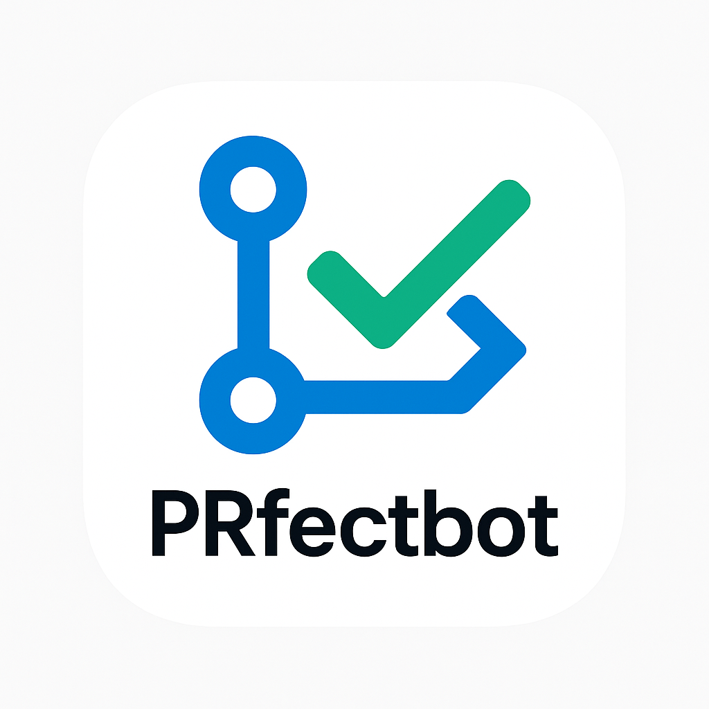

<p align="center">
  
</p>

# PRfectbot

## How to Install PRfectbot in Your Repository

1. Go to the PRfectbot GitHub App installation page:
   - [Install PRfectbot](https://github.com/apps/prfectbot/installations/new)
2. Select the account or organization where you want to install the app.
3. Choose the repositories you want the bot to access (all or specific ones).
4. Click **Install** to complete the process.
5. Ensure the app has the required permissions and that your webhook endpoint is set up if self-hosting.

---

## How to Run the Bot in a Pull Request (PR)

1. **Mention the bot in a PR comment:**

   - Add a comment to your pull request that mentions `@PRfectbot` and includes the word `fix`.
   - Example:

     ```
     @PRfectbot fix this please
     ```

2. **What happens next:**
   - The bot listens for PR comments via a webhook.
   - If the comment contains `@PRfectbot` and the word `fix`, the bot will:
     1. Clone the PR branch.
     2. Run automated fixes (e.g., code formatters like `black`).
     3. Commit and push the fixes to the PR branch.
     4. Optionally, post a comment back on the PR summarizing the changes.

## Supported Command

- `@PRfectbot fix ...`
  - Any comment mentioning the bot and the word `fix` will trigger the bot to attempt automated fixes on the PR branch.

## Notes

- The bot requires appropriate permissions as a GitHub App (write access to contents, read/write access to PRs and issues).
- The auto-fix feature is being actively developed and improved.
